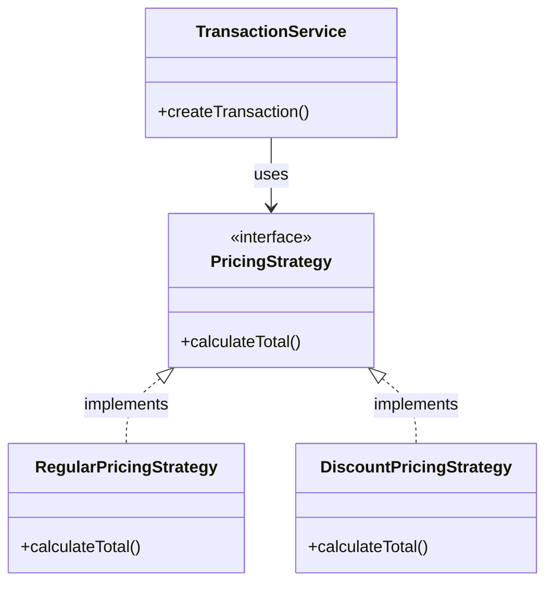
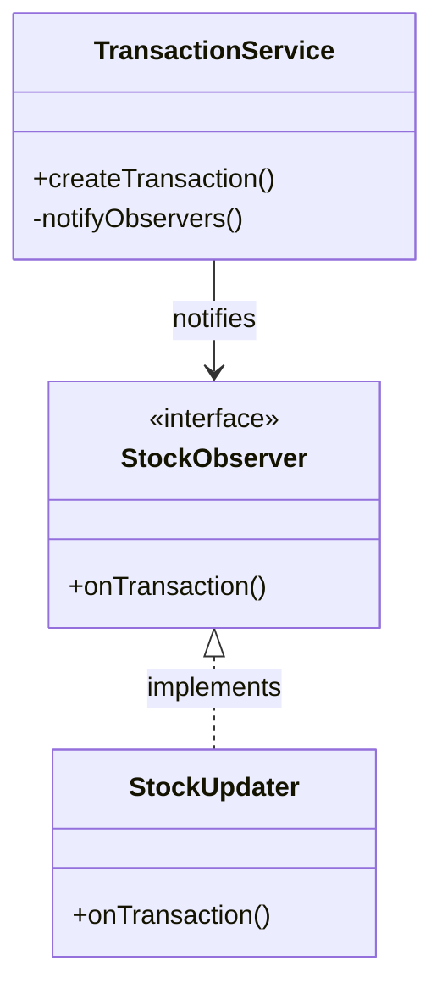
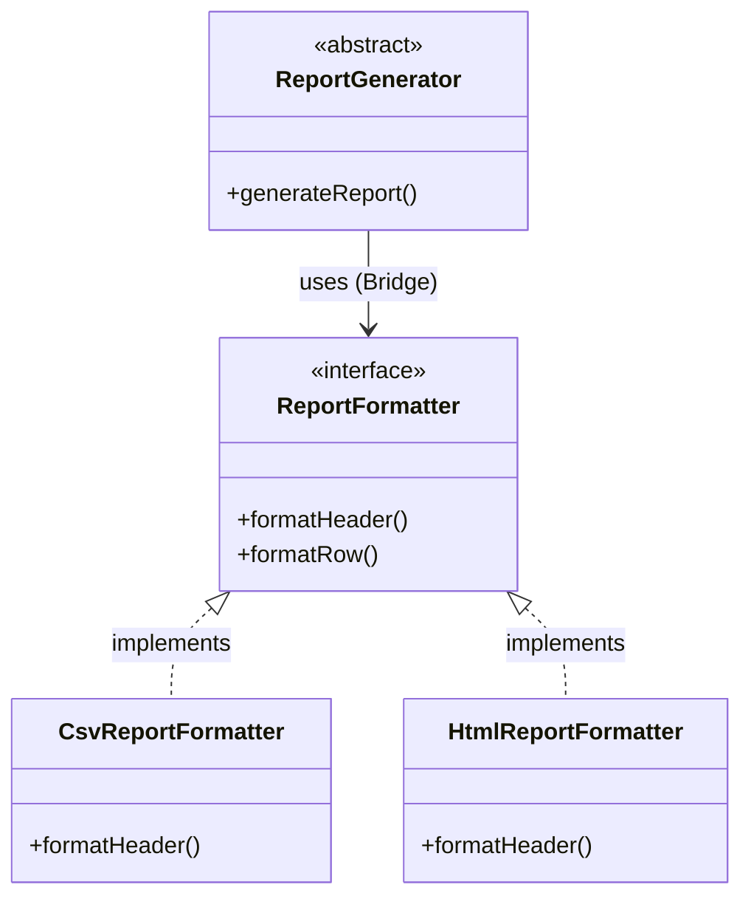

# Minimarket Design Patterns Project

This project is a web-based Minimarket administration platform built with Java and Spring Boot. It demonstrates the application of **SOLID principles**, **GoF patterns**, and **GRASP** to solve real-world business problems like inventory management, transactions, and reporting.

## Features

- **Inventory Management**: Create, list, and delete products.
- **Transactions**: Record **Purchases** (stock entry) and **Sales** (stock exit) with automatic stock updates.
- **Reporting**: Generate transaction reports in **CSV** or **HTML** formats.
- **Authentication**: Secure login for admin access.

## Architecture & Design Patterns

This project is designed to be a reference implementation for clean architecture and design patterns in Java/Spring Boot. Below is a detailed breakdown of how each principle and pattern is applied.

### SOLID Principles

| Principle                       | Applied In           | Example in Code                                                                                          | Why it's good here                                                        |
| :------------------------------ | :------------------- | :------------------------------------------------------------------------------------------------------- | :------------------------------------------------------------------------ |
| **SRP** (Single Responsibility) | `StockUpdater`       | `StockUpdater` only handles inventory updates. It doesn't know about HTTP requests or report formatting. | If logic for updating stock changes, we only touch this class.            |
| **OCP** (Open/Closed)           | `PricingStrategy`    | We can add a `HolidayPricingStrategy` without modifying `TransactionService`.                            | Reduces risk of bugs in existing, tested code when adding features.       |
| **LSP** (Liskov Substitution)   | `Transaction`        | `Purchase` and `Sale` can be used wherever `Transaction` is expected.                                    | Simplifies polymorphism in `TransactionRepository` and `ReportGenerator`. |
| **ISP** (Interface Segregation) | `PricingStrategy`    | The interface only has `calculateTotal`, not unrelated methods like `printReceipt`.                      | Implementations aren't forced to depend on methods they don't use.        |
| **DIP** (Dependency Inversion)  | `TransactionService` | Depends on `StockObserver` (interface), not `StockUpdater` (concrete class).                             | Decouples business logic from specific implementation details.            |

### GoF Patterns Implemented

#### 1. Behavioral Patterns

**Strategy Pattern**

- **Context**: `TransactionService` needs to calculate prices differently (e.g., Regular vs. Discount).
- **Implementation**: `PricingStrategy` interface with `RegularPricingStrategy` and `DiscountPricingStrategy`.
- **Benefit**: Eliminates complex `if-else` logic in the service.



**Observer Pattern**

- **Subject**: `TransactionService`.
- **Observer**: `StockObserver`.
- **Implementation**: When a transaction is saved, `TransactionService` notifies all `StockObserver`s. `StockUpdater` (an observer) then updates the product inventory.
- **Benefit**: Decouples the transaction processing from side effects like stock updates.



**Template Method Pattern**

- **Context**: Generating reports requires a standard structure (Header -> Rows -> Footer) but variable content.
- **Implementation**: `ReportGenerator` defines the `generateReport` flow (final method) and delegates specific steps (`getHeaderLabels`, `getRowData`) to subclasses like `TransactionReportGenerator`.
- **Benefit**: Enforces a consistent report structure while allowing customization.

#### 2. Structural Patterns

**Bridge Pattern**

- **Context**: We need to generate reports in different formats (CSV, HTML) without exploding the class hierarchy (e.g., `HtmlTransactionReport`, `CsvTransactionReport`).
- **Implementation**: `ReportGenerator` (Abstraction) holds a reference to `ReportFormatter` (Implementation).
- **Benefit**: We can add new report types (PDF) or new generators (ProductReport) independently.



**Facade Pattern**

- **Context**: The Controller layer shouldn't deal with the complexity of multiple services (Product, Transaction, Report).
- **Implementation**: `MinimarketFacade` provides a simple interface for the controllers, delegating calls to the appropriate services.
- **Benefit**: Reduces coupling between the web layer and the business layer.

#### 3. Creational Patterns

**Factory Method**

- **Context**: Creating `Purchase` or `Sale` transactions involves different initialization logic.
- **Implementation**: `TransactionFactory` decides which entity to instantiate based on the type string.
- **Benefit**: Centralizes object creation logic.

**Builder Pattern**

- **Context**: `Product` objects have many attributes (code, name, price, stock).
- **Implementation**: `Product.Builder` allows readable and safe object construction.
- **Benefit**: Avoids constructors with long lists of parameters (`new Product(null, "A", "B", 10.0, 5)`).

### GRASP Principles

- **Controller**: `ProductController`, `TransactionController` handle UI events and delegate to the Facade.
- **Information Expert**: `Product` holds its own data; `PricingStrategy` holds the logic for calculation. The object with the information does the work.
- **Low Coupling**: `TransactionService` doesn't know about `StockUpdater` directly, only the `StockObserver` interface.
- **High Cohesion**: `ReportService` focuses solely on reporting; it doesn't handle stock updates or user login.
- **Polymorphism**: Used extensively in `PricingStrategy` and `ReportFormatter` to handle variations without type checking.
- **Pure Fabrication**: `TransactionFactory` and `ReportFormatter` are not domain concepts but are created to support high cohesion and low coupling.

## Prerequisites

- **Java 17** or higher
- **Maven 3.6** or higher (or use the included `mvnw` wrapper)

## Installation

1. **Clone the repository:**

   ```bash
   git clone <repository-url>
   cd design_patterns
   ```

2. **Install dependencies:**
   ```bash
   ./mvnw clean install
   ```

## Running the Application

To start the application, run the following command in the project root:

```bash
./mvnw spring-boot:run
```

The application will start on port `8080`.

- **URL:** [http://localhost:8080](http://localhost:8080)

## Login Credentials

The system is pre-configured with a single admin user:

- **Username:** `admin`
- **Password:** `admin123`

## Database

This project uses **SQLite** for persistence.

- **Database File:** `minimarket.db` (created in the project root)
- **JDBC URL:** `jdbc:sqlite:minimarket.db`
- **Dialect:** `org.hibernate.community.dialect.SQLiteDialect`

## Project Structure

- `src/main/java/com/minimarket/model`: Domain entities (Product, Transaction).
- `src/main/java/com/minimarket/service`: Business logic and Pattern implementations (Strategy, Observer, Factory).
- `src/main/java/com/minimarket/controller`: Web controllers.
- `src/main/java/com/minimarket/service/facade`: Facade pattern entry point.
- `src/main/resources/templates`: Thymeleaf views.

## Testing

To run the automated tests:

```bash
./mvnw clean test
```

### Unit Tests

The project includes unit tests for the core service layer, verifying the correct implementation of business logic and design patterns:

- **ProductServiceTest**: Verifies CRUD operations for products.
- **TransactionServiceTest**: Tests transaction creation, ensuring the **Factory**, **Strategy**, and **Observer** patterns work as expected.
- **ReportServiceTest**: Validates report generation and the **Bridge** pattern integration.
- **CustomUserDetailsServiceTest**: Tests user authentication logic.
- **ProductTest**: Tests the **Builder** pattern for creating product instances.
- **TransactionFactoryTest**: Verifies the **Factory Method** pattern for creating different transaction types.
